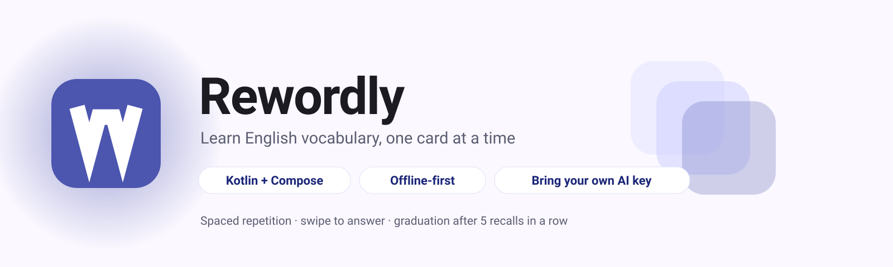
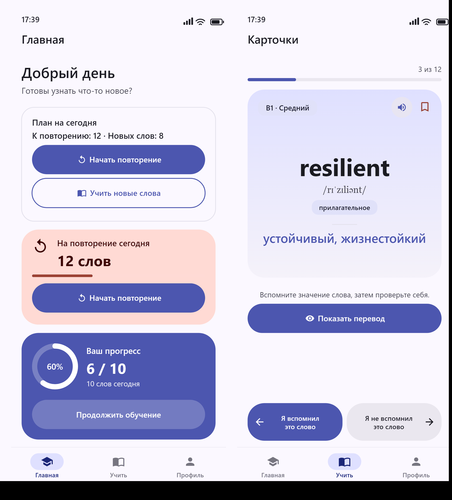

# Rewordly

<picture>
  <source media="(prefers-color-scheme: dark)" srcset="docs/images/banner-dark.svg">
  
</picture>

Native Android app for learning English vocabulary through contextual cards (STEP 1: foundation + UI on local mock data).

<p align="center">
  
</p>

<p align="center">
  <sub>
    <b>Главная</b> — today's plan, the review queue and the daily-goal ring ·
    <b>Карточки</b> — the swipe card with both answers always reachable as buttons
  </sub>
</p>

> The two screens above are **rendered mockups, not device captures** — this project has no emulator
> available on the build machine. Every colour, size and string is taken from the real sources
> (`core/ui/theme/Color.kt`, `Dimens.kt`, `Shape.kt`, `Type.kt` and `values/strings.xml`) and the
> widget structure mirrors the Compose screens, so they stay honest about the app's look — but they
> are not screenshots. Individual screens: [`screen-home.png`](docs/images/screen-home.png),
> [`screen-learn.png`](docs/images/screen-learn.png), plus dark-theme variants
> ([home](docs/images/screen-home-dark.png), [learn](docs/images/screen-learn-dark.png)).

- Kotlin, Jetpack Compose, Material 3, Navigation Compose (type-safe routes)
- Hilt, Room (words, examples, progress), DataStore (settings, onboarding, recent searches)
- Retrofit/OkHttp for AI vocabulary generation — either the project's own backend or a provider the user
  configures with their own key (see [AI vocabulary generation](#ai-vocabulary-generation))
- Interface languages: Russian (default, `values/`) and English (`values-en/`), independent of the learning language

## Learning model

- **Cards** (`Учить`) — one session that mixes words the user has never seen with words still in progress.
  The card is thrown sideways to answer: **left = "I know it / I remembered it"**, **right = "study it / I
  did not remember it"**. The same two answers are always reachable as buttons, so the gesture stays
  optional and screen readers keep working.
- A word the user has never met is triaged (`Я знаю это слово` / `Учить это слово`); afterwards it is
  reviewed (`Я вспомнил` / `Я не вспомнил`). Answering is allowed before the translation is revealed.
- A word has to be recalled `LearningRules.GRADUATION_REPETITIONS` (5) times in a row before it becomes
  `LEARNED` and leaves the study session for good; one miss resets the streak and brings it back.
- **Review** (`Повторение`) — the spaced-repetition queue for words already in the rotation, driven by the
  same swipe card.

## AI vocabulary generation

Generation can run in two ways, and the app picks one automatically at request time:

1. **The user's own key** — in `Настройки → AI` the user picks a provider, optionally overrides the model, and
   pastes an API key. The app then calls that provider directly. This needs no backend at all.
2. **The project backend** — used when no key is configured. The backend holds the provider secret itself.
   See [docs/ai-backend-contract.md](docs/ai-backend-contract.md).

If neither is available the user sees *"AI is not configured"* and nothing is sent.

### Supported providers

| Provider | API | Default model | Key page |
| --- | --- | --- | --- |
| OpenAI | Responses API (`/v1/responses`), falls back to `/v1/chat/completions` | `gpt-6-luna` | `platform.openai.com/api-keys` |
| Anthropic | Messages API (`/v1/messages`) | `claude-haiku-4-5-20251001` | `console.anthropic.com` |
| Google | Gemini (`models/{model}:generateContent`) | `gemini-3.6-flash` | `aistudio.google.com/apikey` |

Each default is deliberately a **cheap model** rather than the flagship. Generating a vocabulary entry is a
small, tightly-specified structured task — the prompt pins the schema and every answer is validated item by
item downstream — so a flagship model buys accuracy the app cannot use while costing far more per call. The
strongest tiers are still offered as suggestions.

The model name is **typed, not picked from a fixed list** — every one of these vendors retires models on a
schedule, so each provider ships a few suggestions and a "use the default" affordance instead of a hard-coded
list that would rot. Model names are not validated by the app: the provider rejects a bad one and the app
shows the provider's own wording.

### How the key is handled

- Stored **encrypted** with AES/GCM under a key held by the Android Keystore
  (`core/security/KeystoreSecretCipher.kt`). Only the ciphertext reaches DataStore.
- Kept in its own DataStore source (`AiPreferencesDataSource`), so the rest of the app never reads it.
- Never logged, never sent anywhere except to the provider it belongs to, and excluded from backups.
- Removing the key in Settings deletes the ciphertext; switching provider keeps the key but drops the model
  override, so a stale model name cannot leak across providers.
- The key is held in memory only for the duration of a request.

### Prompting and validation

The prompt lives in the app (`domain/service/AiPromptBuilder.kt`) and is versioned in code. Answers are
**not** trusted: the provider's envelope is unwrapped first (`core/network/ai/AiResponseParser.kt`), then the
payload goes through the same `GenerationResponseMapper` the backend path uses, so every item is validated
and invalid items are dropped individually. A pasted text is fenced as untrusted data inside the prompt.

`docs/ai-backend-contract.md` describes the JSON contract, the per-field validation rules and the same
educational prompt requirements, since a self-hosted backend has to satisfy them too.

## Structure

```
app/src/main/java/com/rewordly/app/
  core/      common, database, datastore, navigation, network, security, ui (theme + components)
  domain/    model, repository (interfaces), service, usecase
  data/      local (mock vocabulary + mappers), remote, repository (implementations)
  feature/   splash, onboarding, home, learn, word, review, search, ai, profile, settings
```

UI -> ViewModel (StateFlow) -> UseCase/Repository -> Room/DataStore.

## Requirements

JDK 17, Android SDK with platform 35 and build-tools 35.0.0 (`sdk.dir` in `local.properties` or `ANDROID_HOME`).

## Build & run

```bash
./gradlew assembleDebug          # app/build/outputs/apk/debug/app-debug.apk
./gradlew assembleRelease        # release APK (R8 enabled); signed only if a keystore is configured
./gradlew installDebug           # install on a connected device/emulator
./gradlew ktlintCheck lintDebug testDebugUnitTest
```

## CI/CD

Two GitHub Actions workflows live in `.github/workflows/`.

### `ci.yml` — every push to `main` and every pull request

| Job | What it does |
| --- | --- |
| `Lint, ktlint and unit tests` | `ktlintCheck`, `lintDebug`, `testDebugUnitTest`, `assembleDebug`. Uploads the debug APK, the lint HTML report, the ktlint report and the test results as artifacts. |

`lintDebug` is a real gate: `abortOnError = true` is set in `app/build.gradle.kts`, so any lint error fails the
build. Run `./gradlew lintDebug` locally before pushing.

The instrumented suite (`app/src/androidTest`, `./gradlew connectedDebugAndroidTest`) is **not** run in CI — it
needs a booted emulator or a connected device. Run it locally before a release.

### `release.yml` — pushing a tag like `v0.1.0`

Runs the checks, builds a **signed** release APK, verifies the signature with `apksigner`, and attaches the APK
to a GitHub Release (creating it if needed). The version comes from the tag: `v0.2.1` becomes `versionName`
`0.2.1`, and `versionCode` is the workflow run number.

It needs four repository secrets (**Settings → Secrets and variables → Actions**):

| Secret | Contents |
| --- | --- |
| `REWORDLY_KEYSTORE_BASE64` | The keystore file, base64-encoded: `base64 -w0 release.jks` |
| `REWORDLY_KEYSTORE_PASSWORD` | Keystore password |
| `REWORDLY_KEY_ALIAS` | Key alias |
| `REWORDLY_KEY_PASSWORD` | Key password |

Create the keystore once and keep it safe — Android only accepts an update signed with the same key:

```bash
keytool -genkeypair -v -keystore release.jks -alias rewordly \
  -keyalg RSA -keysize 4096 -validity 10000
```

Optionally set a repository **variable** `REWORDLY_API_BASE_URL` (not a secret — it ships inside the APK) to
point the release build at your backend. If it is unset, the build falls back to `https://api.rewordly.invalid/`,
which the app reports as "the AI server is not configured"; users can still use their own API key.

The workflow refuses to publish a non-tag ref, and fails early with a clear message if a secret is missing —
rather than quietly producing an unsigned APK.

### Exported Room schemas must be committed

`app/schemas/` is copied into the instrumented test assets, and `MigrationTest` calls
`MigrationTestHelper.createDatabase(db, 2)` and friends. Those helpers load the schema JSON for the requested
version from disk, so **every version in `app/schemas/<database>/` has to be committed** — otherwise the
migration tests fail in CI (a fresh checkout has only what git knows about) even though they pass locally,
where the files are still on disk. Room writes a new `N.json` on every schema change; commit it with the
migration that produced it.
